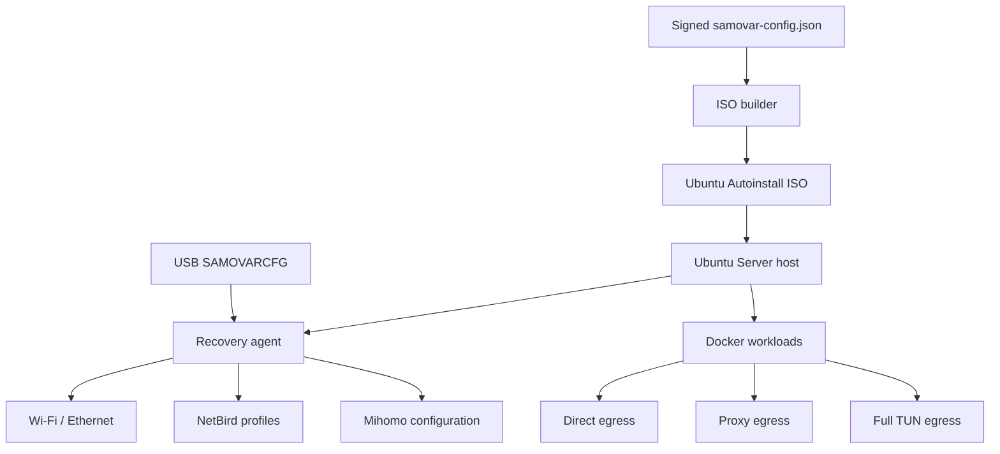

# Техническое задание: Samovar Autoinstall

Статус: согласованная архитектура для реализации  
Целевой репозиторий: <https://github.com/alexsvdk/netbird-ubuntu-autoinstall>  
Целевая машина: `samovar`  
Целевая ОС: Ubuntu Server 26.04.1 LTS, `amd64`

## 1. Назначение системы

Необходимо доработать существующий генератор Ubuntu Autoinstall ISO так, чтобы из одного приватного установочного образа можно было полностью автоматически развернуть домашний сервер `samovar` в Москве.

Сервер предназначен для:

- удалённой разработки по SSH;
- запуска Docker-контейнеров;
- вычислений на NVIDIA RTX 3060 12 GB;
- локальных нейросетей и AI-задач;
- транскодирования видео через FFmpeg/NVENC;
- работы в условиях медленного и потенциально ограниченного российского мобильного интернета;
- длительной автономной работы без постоянного физического доступа владельца.

Установщик должен полностью уничтожить существующие данные на трёх известных дисках, разметить их по заранее заданной схеме, установить систему без графической оболочки, настроить сеть, удалённый доступ, NVIDIA, Docker, NetBird, Mihomo и аварийное обновление сетевой конфигурации с подписанной флешки.

## 2. Исходные ограничения

- Физический доступ после установки ограничен: рядом с машиной находится отец владельца, но основное администрирование выполняется удалённо.
- У машины нет IPMI или другого out-of-band управления.
- Основной интернет — Wi-Fi через SIM-роутер; скорость и доступность внешних ресурсов нестабильны.
- NetBird Cloud и отдельные иностранные хосты могут быть заблокированы.
- VPN/прокси может перестать работать или получить новый адрес.
- Ошибка глобальной маршрутизации не должна лишать владельца одновременно SSH, NetBird и recovery-механизма.
- Все текущие данные на дисках разрешено уничтожить.
- Dual boot с Windows не требуется.
- Графическая оболочка не требуется.
- Полное шифрование дисков не используется: оно потребовало бы ручного ввода пароля после перезагрузки.

## 3. Целевое оборудование

### 3.1. Системные компоненты

| Компонент | Значение |
| --- | --- |
| Производитель и модель | Acer Aspire TC-605 |
| CPU | Intel Core i7-4770, 4 ядра / 8 потоков |
| RAM | 16 GB DDR3-1600 |
| GPU | NVIDIA GeForce RTX 3060, 12 GB VRAM |
| Firmware | UEFI |
| Secure Boot | должен быть выключен |
| Wi-Fi | Intel Dual Band Wireless-AC 8260 |
| Ethernet | Realtek PCIe Ethernet Controller |

### 3.2. Сетевые интерфейсы

| Интерфейс | MAC-адрес | Логическое имя |
| --- | --- | --- |
| Wi-Fi | `34:13:e8:3c:b5:9a` | `wifi0` |
| Ethernet | `44:8a:5b:64:11:2b` | `lan0` |

Имена `wifi0` и `lan0` должны назначаться через Netplan `match.macaddress` и `set-name`, чтобы конфигурация не зависела от непредсказуемых Linux-имён интерфейсов.

### 3.3. Диски

| Роль | Модель | Серийный номер | Размер |
| --- | --- | --- | --- |
| Системный SSD | KINGSTON SA400S37240G | `50026B7683695BFE` | 240 GB |
| Быстрые данные | SBSSD240-NOV-25S3 | `TD2023102401304` | 240 GB |
| Архив | WDC WD10EZEX-21M2NA0 | `WCC3F1336131` | 1 TB |

Выбор диска по размеру запрещён. Конструкция `match: {size: largest}` должна быть полностью удалена из проекта.

Для VM допускается необязательный env-параметр `DISK_SERIAL_PREFIX`, например `QEMU_HARDDISK_`. Он добавляется ко всем трём serial в generated YAML и preflight; по умолчанию префикс пустой для физического сервера.

## 4. Основные архитектурные принципы

1. **Fail closed для разрушительных операций.** Если хотя бы один ожидаемый диск отсутствует, серийный номер не совпадает или найдено неоднозначное соответствие, установка должна остановиться до изменения разделов.
2. **Management plane работает напрямую.** SSH, NetBird, recovery-agent и базовая сеть хоста не должны зависеть от Mihomo.
3. **VPN применяется выборочно.** Контейнеры могут использовать прямой доступ, HTTP/SOCKS-прокси или полный TUN.
4. **Один подписанный формат конфигурации.** Первоначальная установка и последующие изменения с флешки используют одинаковые `samovar-config.json` и `samovar-config.json.sig`.
5. **Конфигурация декларативна.** С флешки нельзя запускать произвольные shell-скрипты или бинарники.
6. **Изменения транзакционны.** Старая рабочая конфигурация удаляется только после успешной проверки новой.
7. **Критический bootstrap работает офлайн.** После установки должны быть доступны Wi-Fi, SSH, NetBird-клиент, Docker, Mihomo и recovery-agent без обязательного скачивания пакетов из интернета.
8. **Секреты не попадают в Git, stdout, journald и build logs.**
9. **Повторный запуск безопасен.** Provisioning и recovery должны быть идемпотентными.

## 5. Общая архитектура



Система состоит из следующих компонентов:

- ISO builder;
- генератор и валидатор подписанной конфигурации;
- renderer Ubuntu Autoinstall;
- destructive preflight для проверки целевого железа;
- offline package/image bundle;
- `samovar-recovery-agent`;
- udev-правило и systemd units для флешки;
- NetBird profile manager;
- Mihomo proxy/TUN layer;
- provisioning-сервис для Docker, NVIDIA и системных пакетов;
- валидаторы и автоматические тесты.

## 6. Подписанная конфигурация

### 6.1. Файлы

Каноническая конфигурация состоит ровно из двух файлов:

```text
samovar-config.json
samovar-config.json.sig
```

JSON хранится в UTF-8 без BOM. Подпись является detached SSH signature.

Файл содержит секреты в открытом виде и должен считаться приватным. Подпись обеспечивает подлинность и целостность, но не шифрование.

### 6.2. Подписание

Используется существующий Ed25519 SSH-ключ владельца:

```bash
ssh-keygen -Y sign \
  -f ~/.ssh/id_ed25519 \
  -n samovar-recovery \
  samovar-config.json
```

На сервере хранится только публичный ключ в:

```text
/etc/samovar-recovery/allowed_signers
```

Проверка выполняется через `ssh-keygen -Y verify` с namespace `samovar-recovery`.

Должна поддерживаться ротация ключей через список из нескольких заранее доверенных публичных ключей. Добавление нового доверенного ключа с флешки в первой версии не поддерживается, чтобы не создавать цепочку самоподписанного доверия.

### 6.3. Минимальная структура JSON

```json
{
  "schema": 1,
  "target": "samovar",
  "generation": 2026091901,
  "created_at": "2026-09-19T21:00:00Z",
  "wifi": {
    "mode": "merge",
    "networks": [
      {
        "ssid": "MoscowHome",
        "password": "secret",
        "hidden": false
      },
      {
        "ssid": "MoscowHome-5G",
        "password": "secret",
        "hidden": false
      }
    ]
  },
  "netbird": {
    "profile": "netbird-cloud",
    "management_url": "https://api.netbird.io:443",
    "setup_key": "one-off-key"
  },
  "mihomo": {
    "enabled": true,
    "config": {
      "mode": "rule",
      "mixed-port": 7890,
      "allow-lan": false,
      "external-controller": "127.0.0.1:9090",
      "secret": "controller-secret",
      "proxies": [],
      "proxy-groups": [],
      "rules": []
    }
  }
}
```

JSON является каноническим transport-форматом. Recovery-agent преобразует `mihomo.config` в `/etc/mihomo/config.yaml`, поскольку нативная документация Mihomo и большинство инструментов используют YAML.

### 6.4. Правила схемы

- `schema` — обязательное целое число. Неизвестная версия схемы отклоняется.
- `target` должен строго равняться `samovar`.
- `generation` — положительное монотонно возрастающее целое число.
- Повторное применение той же или меньшей `generation` запрещено.
- Неизвестные поля верхнего уровня должны отклоняться, чтобы опечатки не игнорировались молча.
- Максимальный размер JSON необходимо ограничить, например 4 MiB.
- `wifi`, `netbird` и `mihomo` являются опциональными секциями для частичного обновления.
- `wifi.mode` поддерживает `merge` и `replace`; значение по умолчанию — `merge`.
- `management_url` принимает только HTTPS URL. Небезопасный TLS и `--insecure` запрещены.
- Для self-hosted NetBird должен использоваться сертификат публично доверенного CA.
- `setup_key` должен быть одноразовым или сильно ограниченным по сроку и количеству использований.
- Mihomo-конфигурация должна содержать хотя бы один работоспособный локально описанный proxy node. Одного subscription URL недостаточно из-за bootstrap-проблемы.
- JSON и подпись не должны изменяться после подписания.

### 6.5. Защита от replay

Последнее успешно применённое состояние хранится в:

```text
/var/lib/samovar-recovery/state.json
```

Состояние содержит:

- последнюю `generation`;
- SHA-256 применённого JSON;
- дату и результат применения;
- активный NetBird profile;
- SHA-256 активного Mihomo-конфига.

Конфигурация с меньшей или равной `generation` игнорируется и журналируется. Время системы не используется как единственный механизм защиты от replay.

## 7. Использование конфигурации при установке

ISO builder должен:

1. Прочитать `samovar-config.json`.
2. Проверить SSH-подпись до любого использования данных.
3. Валидировать JSON Schema и семантические ограничения.
4. Сгенерировать из `wifi.networks` секцию Ubuntu Autoinstall/Netplan, чтобы Wi-Fi был доступен уже внутри установщика.
5. Встроить исходные подписанные файлы в ISO без изменений.
6. Установить публичный ключ, recovery-agent, udev и systemd units в target system.
7. Скопировать подписанные файлы в root-only bootstrap inbox установленной системы.
8. На первом запуске применить их тем же recovery-agent, который используется для USB.

Отдельный `netbird-enroll.sh` из текущей реализации необходимо удалить. Первичная регистрация NetBird является обычной операцией recovery-agent при отсутствии существующего профиля.

## 8. Recovery-флешка

### 8.1. Формат носителя

- FAT32 для совместимости с Windows и macOS.
- Метка файловой системы: `SAMOVARCFG`.
- В корне находятся `samovar-config.json` и `samovar-config.json.sig`.
- Дополнительные файлы игнорируются.

### 8.2. Обнаружение

udev должен реагировать на добавление block device с меткой `SAMOVARCFG` и запускать systemd service. Носитель монтируется во временный каталог с опциями:

```text
ro,nodev,nosuid,noexec
```

Тот же поиск выполняется при загрузке системы, чтобы поддержать флешку, вставленную до включения компьютера.

### 8.3. Обработка

1. Найти носитель по label.
2. Смонтировать read-only.
3. Скопировать JSON и signature во временный каталог в `/run`.
4. Проверить подпись.
5. Проверить schema, target и generation.
6. Скопировать уже проверенный пакет в root-only staging на системном диске.
7. Размонтировать флешку.
8. Применить Wi-Fi, NetBird и Mihomo транзакционно.
9. При временной ошибке оставить staging и повторять попытки по systemd timer.
10. После полного успеха записать state и удалить staging с секретами.

Нельзя выполнять, импортировать или `source`-ить какие-либо команды с флешки.

## 9. Дисковая разметка

### 9.1. Preflight

До запуска curtin storage actions скрипт должен проверить:

- архитектура `amd64`;
- firmware загружена в UEFI mode;
- каждый из трёх серийных номеров присутствует ровно один раз;
- установочная флешка не совпадает ни с одним target serial;
- системный SSD имеет ожидаемый минимальный размер;
- конфигурация storage ссылается только на известные serial;
- отсутствует выбор диска по размеру.

Если проверка не прошла, установщик не должен изменять ни один диск.

### 9.2. Системный SSD

Диск `50026B7683695BFE` полностью стирается и получает GPT:

- EFI System Partition: 1 GiB, FAT32, `/boot/efi`;
- root: всё оставшееся пространство, ext4, `/`;
- два swap-файла создаются после установки: `/swapfile` на системном SSD и `/data/swapfile` на SSD данных; размер каждого задаётся `SWAP_SIZE_GIB` и по умолчанию равен 1 GiB.

`/home` остаётся частью root filesystem. Отдельный LVM не требуется.

### 9.3. Быстрый SSD

Диск `TD2023102401304` полностью стирается:

- GPT;
- один ext4-раздел на весь диск;
- mount point `/data`;
- subdirectories:
  - `/data/docker`;
  - `/data/models`;
  - `/data/cache`;
  - `/data/tmp`;

Docker `data-root` должен быть `/data/docker`.

### 9.4. HDD

Диск `WCC3F1336131` полностью стирается:

- GPT;
- один ext4-раздел на весь диск;
- mount point `/archive`;
- subdirectories:
  - `/archive/incoming`;
  - `/archive/output`;
  - `/archive/backups`.

### 9.5. Общие требования

- Использовать стабильные UUID в `/etc/fstab`.
- Включить `fstrim.timer` для SSD.
- Не использовать RAID, ZFS или объединение дисков в один failure domain.
- Не использовать постоянный online discard; достаточно periodic fstrim.
- Не продолжать загрузку в полноценный рабочий режим, если `/data` не смонтирован, чтобы Docker случайно не заполнил root filesystem.

## 10. Сеть и Wi-Fi

### 10.1. Базовая конфигурация

- Ethernet и Wi-Fi используют DHCPv4.
- IPv6 не должен отключаться без отдельной причины.
- Ethernet должен иметь меньшую route metric и выигрывать при одновременном подключении.
- Wi-Fi должен использовать Intel `iwlwifi` и `wpa_supplicant`.
- Оба интерфейса должны быть `optional`, чтобы отсутствие кабеля или точки доступа не блокировало загрузку.
- DNS по умолчанию берётся из DHCP.
- Публичные DNS должны быть настраиваемым fallback, а не жёстко прошитым обязательным значением.

### 10.2. Несколько сетей

Система должна поддерживать произвольное число WPA2/WPA3-Personal сетей:

- обычные и hidden SSID;
- разные пароли;
- SSID в 2.4 и 5 GHz;
- одинаковый SSID для обоих диапазонов;
- обновление списком с recovery-флешки.

Intel AC 8260 поддерживает Wi-Fi 5/802.11ac. Диапазон 5 GHz не нужно принудительно фиксировать: адаптер должен иметь возможность выбрать 2.4 GHz при слабом сигнале.

При `merge` новые сети добавляются, старые сохраняются. При `replace` удаляются только управляемые Samovar Wi-Fi profiles; системные loopback/Ethernet настройки не затрагиваются.

### 10.3. Транзакционное применение

Перед заменой Netplan:

- создать root-only backup текущего managed-файла;
- сгенерировать новый файл во временном каталоге;
- выполнить `netplan generate`;
- атомарно заменить конфигурацию;
- выполнить `netplan apply`;
- проверить наличие default route и доступность хотя бы одного заданного endpoint;
- при синтаксической или runtime-ошибке восстановить backup.

## 11. NetBird

### 11.1. Первичная установка

- NetBird-клиент должен быть доступен локально, не полагаясь на `curl | sh` при первом запуске.
- Peer name и hostname: `samovar`.
- Первичный profile берётся из подписанного JSON.
- Setup key передаётся через временный файл и `--setup-key-file`, а не через аргумент процесса.
- Временный файл создаётся в `/run`, имеет mode `0600` и удаляется сразу после использования.

### 11.2. Смена management host

Новая конфигурация применяется через NetBird profiles:

1. Сохранить ID активного профиля.
2. Создать новый profile с уникальным именем, включающим `generation`.
3. Переключиться на новый profile.
4. Выполнить `netbird up` с новым management URL и setup-key-file.
5. Дождаться успешного `netbird status --check startup`.
6. Проверить, что фактический management URL совпадает с ожидаемым.
7. После успеха удалить старый локальный profile.
8. Удалить setup key и staged JSON.

При ошибке необходимо вернуть старый profile, поднять его, сохранить новый signed package в staging и повторять попытку по таймеру.

Локальное удаление старого профиля не удаляет старую peer-запись из прежнего NetBird management server; это выполняется вручную при доступности старой панели.

### 11.3. Firewall

- UFW: deny incoming, allow outgoing.
- SSH разрешается на `wt0`, `wifi0` и `lan0`, но не глобальным правилом для всех интерфейсов.
- NetBird traffic на `wt0` разрешён.
- Mihomo controller и proxy ports не открываются во внешние интерфейсы.
- SSH password authentication отключена.
- Root SSH login отключён.

## 12. Mihomo и управление исходящим трафиком

### 12.1. Решение по виртуализации

Proxmox, KVM VM, Incus и GPU passthrough не используются. Причины:

- только 16 GB RAM;
- потребность в простой работе RTX 3060;
- потребность в высокой ремонтопригодности удалённой машины;
- отсутствие IPMI;
- сложность consumer BIOS/IOMMU и дополнительная точка отказа.

Изоляция выполняется Docker network namespaces и Mihomo.

### 12.2. Management plane

Следующий трафик хоста всегда идёт напрямую и не перехватывается TUN:

- SSH;
- NetBird;
- recovery-agent;
- DHCP, NTP и локальная сеть;
- системные healthchecks.

На хосте запрещено включать глобальный Mihomo TUN как default route.

### 12.3. Режимы workloads

Поддерживаются три режима:

| Режим | Назначение |
| --- | --- |
| `direct` | Обычный Docker bridge, прямой российский egress |
| `proxy` | Обычная сеть с `HTTP_PROXY`, `HTTPS_PROXY` и `ALL_PROXY` через Mihomo |
| `vpn` | Полный трафик контейнера через Mihomo TUN с kill switch |

Режим по умолчанию — `direct`.

### 12.4. Proxy mode

Основной Mihomo instance должен предоставлять:

- mixed HTTP/SOCKS port на `127.0.0.1:7890` для host tools;
- доступ из специально созданной Docker proxy network;
- controller только на `127.0.0.1:9090`;
- обязательный controller secret;
- healthcheck подключения к proxy node.

Для хоста предоставляются wrappers:

```text
proxy-run <command...>
proxy-shell
```

Они выставляют proxy environment variables только для конкретного процесса или shell. Они не изменяют глобальные маршруты.

Опционально через этот proxy настраиваются Docker pulls, Git, apt, npm/pnpm, pip и Hugging Face. Отказ proxy не должен останавливать SSH, NetBird и локальную загрузку ОС.

### 12.5. Full TUN mode

Для полного туннеля используется Mihomo sidecar с:

- `/dev/net/tun`;
- capability `NET_ADMIN`;
- read-only configuration;
- strict routing;
- firewall kill switch;
- healthcheck;
- запретом прямого fallback egress.

Workload использует `network_mode: service:vpn` или эквивалентное совместное network namespace. GPU devices остаются независимыми и могут передаваться workload-контейнеру.

Публикация входящих портов выполняется на VPN sidecar и может быть привязана к localhost или host interfaces по явной настройке.

### 12.6. Обновление конфигурации

Recovery-agent должен:

1. Проверить JSON signature и schema.
2. Преобразовать `mihomo.config` во временный YAML.
3. Выполнить `mihomo -t -f <temporary-config>` или актуальный эквивалент validate-команды.
4. Поднять временный test instance без изменения production routes.
5. Проверить DNS и HTTPS через новый proxy.
6. Атомарно заменить production config.
7. Перезапустить proxy instance.
8. Проверить healthcheck.
9. При ошибке восстановить старый config и service.

Subscription URL может использоваться только для последующих обновлений. Первоначальный JSON обязан содержать хотя бы один inline node или локальный provider cache, чтобы избежать bootstrap deadlock.

## 13. Docker, NVIDIA и AI workloads

### 13.1. Docker

- Docker Engine и Compose v2 устанавливаются офлайн или из встроенного локального APT repository.
- Пользователь `alex` добавляется в группу `docker`.
- `data-root`: `/data/docker`.
- Logging driver: `local`.
- Ограничение логов одного контейнера: приблизительно 100 MiB, например 10 файлов по 10 MiB.
- Docker не стартует до успешного mount `/data`.
- Необходимо предоставить Compose templates для `direct`, `proxy` и `vpn`.

### 13.2. NVIDIA

- Устанавливается рекомендованный Ubuntu/NVIDIA driver для RTX 3060.
- Устанавливается NVIDIA Container Toolkit.
- Docker настраивается через `nvidia-ctk`.
- Host CUDA Toolkit по умолчанию не устанавливается.
- CUDA runtimes предоставляются контейнерами.
- Включается `nvidia-persistenced`, если он поддерживается выбранным driver package.

### 13.3. Проверки GPU

После provisioning должны проходить:

```bash
nvidia-smi
docker info
nvidia-ctk cdi list
ffmpeg -hide_banner -encoders
```

FFmpeg должен показывать как минимум `h264_nvenc` и `hevc_nvenc`.

Проверка CUDA в контейнере должна быть предусмотрена, но скачивание тестового CUDA image не должно быть обязательным условием завершения первого boot, если образ не был встроен в ISO.

## 14. Offline bootstrap и работа при плохом интернете

ISO должен включать критический минимум, необходимый для получения удалённого доступа и запуска proxy:

- OpenSSH Server;
- `wpa_supplicant`, `iw`, firmware Intel Wi-Fi;
- NetBird client;
- Docker Engine и Compose v2;
- Mihomo Docker image, загруженный заранее или доступный через Docker registry;
- recovery-agent;
- Python runtime, используемый recovery-agent;
- `ca-certificates`, `curl`, `git`, `tmux`;
- UFW;
- NVIDIA driver и NVIDIA Container Toolkit, если размер образа остаётся приемлемым.

Предпочтительный способ — встроенный локальный APT repository с зафиксированными пакетами, зависимостями, checksums и metadata.

### 14.1. Приоритет зеркал Яндекса

Для всех сетевых загрузок, где существует совместимое зеркало или endpoint Яндекса, он используется по умолчанию. Это относится, в частности, к Ubuntu APT packages, security updates, Python и Node.js package registries, Docker/OCI images, Git repositories/releases, Hugging Face artifacts и прочим зависимостям сборки и provisioning.

Приоритет источников для online fallback:

1. зеркало или endpoint Яндекса;
2. другой настраиваемый российский mirror;
3. официальный country mirror;
4. `archive.ubuntu.com`, официальный security mirror или upstream-источник.

Для каждого типа зависимости builder и provisioning должны явно задавать поддерживаемый endpoint Яндекса, если он доступен, а не полагаться на случайный выбор зеркала менеджером пакетов. Если зеркало Яндекса отсутствует, несовместимо с нужным форматом артефакта или недоступно после bounded retries, разрешается перейти к следующему источнику. Порядок fallback должен быть настраиваемым и не должен менять содержимое уже зафиксированного offline bundle.

Все сетевые операции используют bounded retries, понятные таймауты и systemd retry вместо бесконечных shell loops.

Базовый Ubuntu ISO должен проверяться по официальным SHA256SUMS и подписи до repack.

### 14.2. Pre-build validation в Docker

До сборки ISO builder обязан запустить воспроизводимый validation job в Docker. Проверка должна завершаться с ошибкой и запрещать сборку ISO, если хотя бы одна обязательная конфигурация, репозиторий или артефакт не прошли проверку.

Validation job должен:

- использовать зафиксированные версии инструментов и образов, максимально совпадающие с теми, которые будут встроены в ISO;
- проверить JSON Schema, SSH signature, семантические ограничения, отсутствие неизвестных полей и защиту от replay;
- проверить доступность и корректность настроенных APT, Python, Node.js, Docker/OCI, Git и Hugging Face источников;
- выполнить пробное получение metadata и, где возможно, небольшого контрольного артефакта из каждого обязательного repository или mirror;
- проверить checksums, подписи, архитектуру `amd64`, размер и наличие всех offline packages, binaries и container images, необходимых для bootstrap;
- проверить, что выбранные зеркала Яндекса действительно поддерживают нужный формат и версию каждого артефакта;
- не печатать Wi-Fi passwords, NetBird setup keys, proxy credentials и другие секреты в stdout, logs или Docker layer history;
- использовать bounded timeouts и retries, после чего выдавать понятную ошибку с именем недоступного источника или артефакта.

#### Проверка Clash/Mihomo-конфигурации

Поле `mihomo.config` должно проверяться как Clash-compatible/Mihomo-конфигурация до начала сборки. Builder обязан:

1. преобразовать JSON-конфигурацию в тот же YAML, который будет установлен на target;
2. выполнить проверку синтаксиса и схемы актуальным бинарником Mihomo, например `mihomo -t -f <config.yaml>`;
3. запустить временный Mihomo instance в отдельном Docker container без `NET_ADMIN`, TUN и изменения маршрутов builder host;
4. проверить загрузку всех inline proxies, proxy-groups и rules, включая обязательный локальный bootstrap node;
5. проверить controller с configured secret, локальный HTTP/SOCKS proxy, DNS resolution и HTTPS request через выбранный proxy;
6. проверить, что нерабочий node или повреждённое поле приводит к отказу validation job, а не к сборке частично рабочей конфигурации;
7. удалить временный container, generated YAML и все секретсодержащие рабочие файлы после завершения проверки.

Проверка внешней доступности proxy node должна быть отделена от offline syntax validation. При недоступности внешнего node builder обязан явно пометить результат как failed или externally unavailable; это не должно маскироваться успешной проверкой только YAML-синтаксиса.

## 15. Пользователи и SSH

- Hostname: `samovar`.
- Основной пользователь: `alex`.
- При сборке задаётся список из одного или нескольких SSH public keys.
- Все заданные ключи устанавливаются в `/home/alex/.ssh/authorized_keys` с корректными владельцем и permissions.
- Каждый ключ должен быть валидным SSH public key; дубликаты отклоняются или удаляются до генерации ISO.
- Удаление или ротация одного ключа не должны требовать изменения остальных ключей.
- Приватные SSH keys никогда не копируются в target system, ISO или build logs.
- Password login по SSH запрещён.
- Локальный console password задаётся интерактивно при сборке и хранится только как hash в autoinstall.
- Root login запрещён.
- Возможность `NOPASSWD` sudo должна быть явным build option; текущее поведение репозитория можно сохранить как default для этой конкретной машины.
- SSH host keys генерируются на target при первой установке и не встраиваются в ISO.

## 16. Системные сервисы и надёжность

Необходимо:

- отключить sleep, suspend, hibernate и hybrid sleep;
- включить automatic security updates;
- ограничить persistent journald приблизительно 100 MiB;
- включить `fstrim.timer`;
- установить `smartmontools`, `btop`, `nvtop`, `tmux`, `git`, `curl`, `jq`;
- включить NTP;
- добавить проверку свободного места на `/`, `/data` и `/archive`;
- не допускать запуска Docker при отсутствии `/data`;
- вести отдельные журналы provisioning и recovery без секретов;
- после успешной установки выключить машину, а не перезагружать её в оставленную USB-флешку.

В BIOS вручную требуется включить `Restore on AC Power Loss: Power On`. Автоматически изменить эту настройку из Ubuntu нельзя гарантировать.

## 17. Порядок установки

### 17.1. Сборка

1. Клонировать репозиторий.
2. Создать `.env` из example.
3. Указать hostname, username, список SSH public keys и build options.
4. Создать приватный `samovar-config.json` с Wi-Fi, NetBird и Mihomo.
5. Подписать JSON.
6. Запустить builder; builder сначала выполняет обязательный Docker pre-build validation.
7. Только после успешной проверки builder собирает ISO и проверяет signature, schema, base ISO checksum и тесты.
8. Получить ISO и отдельный SHA-256 output-файл.

### 17.2. Физическая установка

1. Записать ISO на USB через Rufus, Balena Etcher или Raspberry Pi Imager.
2. Вставить USB в `samovar`.
3. Загрузиться в UEFI boot menu.
4. Запустить autoinstall.
5. Preflight проверяет железо.
6. Все три известных диска полностью стираются.
7. Система устанавливается и выключается.
8. Удалить флешку.
9. Включить компьютер.
10. Дождаться первого boot и появления peer `samovar` в NetBird.
11. Проверить SSH.
12. Отозвать setup key.
13. Полностью стереть или перезаписать установочную флешку.

## 18. Поведение при первом запуске

Рекомендуемый порядок systemd units:

1. local filesystems и mount `/data`, `/archive`;
2. базовая сеть;
3. `samovar-recovery-bootstrap.service`;
4. применение Wi-Fi и запуск Mihomo proxy instance;
5. NetBird enrollment с повторными попытками;
6. Docker и NVIDIA provisioning;
7. финальный health report.

Отсутствие интернета не должно считать установку повреждённой. Сервисы должны оставаться в retryable state и автоматически продолжать после восстановления сети.

## 19. Структура репозитория

Предлагаемая структура:

```text
.
├── .env.example
├── .gitignore
├── README.md
├── build-autoinstall-iso.sh
├── build-recovery-config.sh
├── patch-grub.py
├── render-autoinstall.py
├── validate-autoinstall-iso.py
├── schemas/
│   └── samovar-config.schema.json
├── recovery/
│   ├── samovar-recovery-agent.py
│   ├── samovar-recovery.service
│   ├── samovar-recovery.timer
│   ├── samovar-recovery-scan.service
│   └── 99-samovar-recovery.rules
├── provisioning/
│   ├── provision-host.sh
│   ├── docker-daemon.json
│   ├── mihomo.service
│   ├── proxy-run
│   └── compose-templates/
│       ├── direct.compose.yml
│       ├── proxy.compose.yml
│       └── vpn.compose.yml
├── offline/
│   ├── packages.lock.json
│   └── images.lock.json
├── examples/
│   └── samovar-config.example.json
└── tests/
    ├── test_config_schema.py
    ├── test_signature.py
    ├── test_storage.py
    ├── test_network.py
    ├── test_netbird_migration.py
    ├── test_mihomo_update.py
    ├── test_prebuild_validation.py
    ├── test_clash_config.py
    ├── test_replay_protection.py
    └── test_iso_validation.py
```

Generated files, real configs, signatures, setup keys, Wi-Fi credentials, proxy credentials and ISO images должны быть в `.gitignore`.

## 20. Тестирование

### 20.1. Unit tests

- valid/invalid JSON schema;
- SSH signature verification;
- wrong signer;
- modified JSON after signing;
- wrong target;
- replayed generation;
- partial Wi-Fi-only update;
- partial NetBird-only update;
- partial Mihomo-only update;
- `merge` и `replace` Wi-Fi semantics;
- NetBird rollback;
- Mihomo validation и rollback;
- redaction of secrets in logs.

### 20.2. Pre-build validation tests

- valid signed configuration и доступные repositories позволяют validation job завершиться успешно;
- недоступный или несовместимый mirror, repository, package, binary или container image останавливает builder до создания ISO;
- validation job проверяет checksums, подписи, архитектуру и наличие обязательных offline artifacts;
- секреты отсутствуют в stdout, stderr, Docker layer history и сохранённых build logs;
- валидный Clash/Mihomo YAML проходит проверку актуальным Mihomo binary;
- поврежденный YAML, неизвестное поле, отсутствующий proxy node, неработающий proxy group или некорректное правило останавливают сборку;
- временный Mihomo container выполняет DNS и HTTPS test через proxy и использует configured controller secret;
- запуск тестового Mihomo не требует `NET_ADMIN`, TUN или изменения default route Docker host;
- отказ внешнего proxy node не маскируется одной только успешной YAML syntax check;
- temporary containers, generated YAML и staging files удаляются после теста без утечки секретов.

### 20.3. Storage tests

- в generated YAML отсутствует `size: largest`;
- все disk actions используют точные serial;
- root находится на Kingston SSD;
- `/data` находится на SBSSD;
- `/archive` находится на WD HDD;
- все диски получают wipe action;
- USB не может совпасть с target;
- missing disk приводит к abort до destructive actions.

### 20.4. Network tests

- Wi-Fi и Ethernet match по MAC;
- несколько SSID корректно рендерятся;
- special characters в SSID/password экранируются;
- Ethernet получает предпочтительную route metric;
- конфигурация проходит `netplan generate`;
- management traffic не получает global TUN route.

### 20.5. ISO validation

- ISO загружается в UEFI;
- GRUB содержит `autoinstall`;
- GRUB timeout остаётся коротким, но ненулевым;
- embedded JSON и signature совпадают с исходными;
- embedded secrets не печатаются валидатором;
- output ISO имеет SHA-256 manifest;
- после установки выполняется poweroff.

### 20.6. Integration tests

По возможности использовать QEMU VM с тремя виртуальными дисками для проверки:

- полной автоматической установки;
- fail-closed при отсутствии диска;
- mount layout;
- первого boot;
- идемпотентного повторного запуска provisioning;
- чтения signed config с виртуальной USB/FAT32 volume.

NetBird и Mihomo внешние вызовы в CI должны мокироваться. Отдельный ручной smoke test выполняется с реальными endpoints перед финальной записью USB.

## 21. Критерии приёмки

Система считается готовой, если:

1. Из чистого checkout одной командой собирается проверенный bootable ISO.
2. Реальные секреты не присутствуют в Git history.
3. ISO отказывается устанавливать систему при несовпадении hardware serials.
4. ISO без вопросов стирает три ожидаемых диска и создаёт заданную разметку.
5. После первого boot машина подключается к одной из известных Wi-Fi-сетей.
6. Peer `samovar` появляется в NetBird.
7. SSH доступен только по ключу.
8. Docker хранит данные на `/data/docker`.
9. `nvidia-smi` видит RTX 3060 12 GB.
10. Docker получает доступ к GPU через NVIDIA Container Toolkit.
11. FFmpeg видит NVENC encoders.
12. Mihomo предоставляет локальный HTTP/SOCKS proxy, не меняя default route хоста.
13. Test container может работать в режимах direct, proxy и full TUN.
14. Остановка Mihomo не отключает SSH и NetBird.
15. Подписанная флешка с большей generation добавляет новую Wi-Fi-сеть.
16. Подписанная флешка может перевести peer на новый self-hosted NetBird.
17. Подписанная флешка может обновить Mihomo config.
18. Конфигурация с неверной подписью или старой generation не применяется.
19. Ошибка новой NetBird/Mihomo конфигурации приводит к rollback или retry без уничтожения последнего рабочего состояния.
20. Setup keys и временные configs удаляются с установленного компьютера после успешного применения.

## 22. Что не входит в первую версию

- Desktop environment и удалённый GUI;
- dual boot с Windows;
- full-disk encryption;
- Proxmox/KVM/Incus;
- GPU passthrough;
- Kubernetes;
- автоматическое изменение BIOS settings;
- публичное открытие SSH;
- автоматическая установка произвольных скриптов с recovery-флешки;
- хранение приватного signing key на сервере;
- автоматическое удаление старого peer из недоступной NetBird management panel.

## 23. Этапы реализации

### Этап 1. Безопасный фундамент

- обновить Ubuntu default до 26.04.1;
- добавить проверку base ISO;
- заменить largest-disk layout на exact serial layout;
- добавить hardware preflight;
- добавить несколько Wi-Fi-сетей;
- обновить тесты ISO.

### Этап 2. Signed configuration

- JSON Schema;
- SSH signing/verification;
- generation/replay state;
- initial config embedding;
- единый recovery-agent.

### Этап 3. USB recovery

- udev detection;
- read-only mount;
- staging и retry timer;
- Wi-Fi transaction;
- NetBird profile migration и rollback.

### Этап 4. Compute stack

- `/data` и Docker data-root;
- NVIDIA driver;
- NVIDIA Container Toolkit;
- FFmpeg/NVENC;
- monitoring tools.

### Этап 5. Mihomo egress

- offline artifact;
- local proxy instance;
- signed config update;
- direct/proxy/vpn templates;
- TUN kill switch;
- proxy healthchecks и rollback.

### Этап 6. Hardening и документация

- UFW;
- SSH hardening;
- log redaction;
- bounded logs;
- end-to-end runbook для отца;
- финальный bare-metal smoke test.

## 24. Ручные входные данные перед сборкой

Перед созданием финального ISO владелец должен предоставить локально, без коммита в Git:

- один или несколько SSH public keys;
- console password;
- список Wi-Fi SSID/password;
- одноразовый NetBird setup key;
- первоначальный NetBird management URL;
- Mihomo nodes или готовую конфигурацию, содержащую хотя бы один inline bootstrap node;
- Mihomo controller secret;
- SSH private key только для локального подписания JSON.

## 25. Эксплуатационные замечания

- Установочный ISO и записанная USB-флешка содержат Wi-Fi-пароли, NetBird setup key и proxy credentials. После установки их необходимо безопасно стереть.
- Recovery-флешку также следует очищать после успешного применения.
- Private signing key никогда не должен попадать на `samovar`.
- Для аварийного восстановления желательно заранее протестировать создание и применение signed USB package до того, как машина будет оставлена без физически доступного специалиста.
- Самый полезный будущий аппаратный апгрейд — увеличение RAM до 32 GB, затем SATA SSD на 1–2 TB для моделей.

